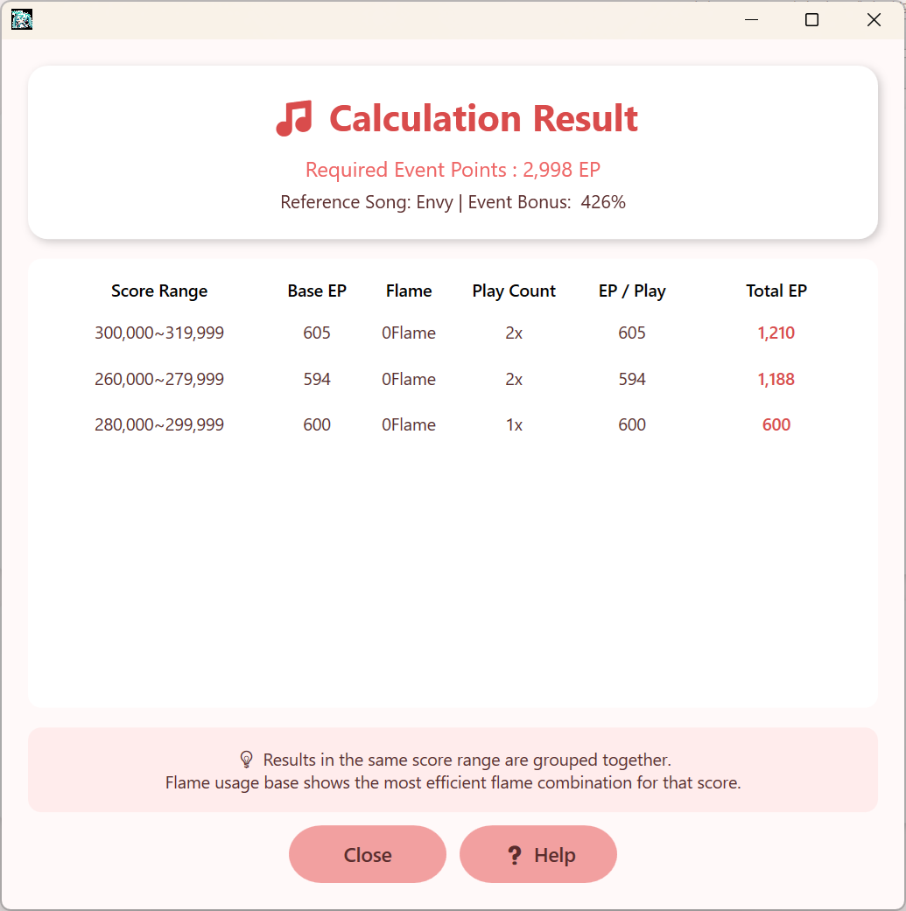

# 🎯 점수아트 도우미 v1.2 (ProSekai Event Calculator)
**프로젝트 세카이** 이벤트에서 **목표 이벤트 포인트에 정확히 도달**할 수 있는 **최적의 플레이 조합을 계산**해주는 Windows용 비공식 도우미 프로그램입니다.

---

## 🌍 **NEW! 글로벌 다국어 지원**
**v2.0 주요 업데이트**: 이제 **한국, 일본, 글로벌 서버** 모든 사용자가 자신의 언어로 이용할 수 있습니다!
- 🇰🇷 **한국어** (기본)
- 🇯🇵 **日本語** (일본어) 
- 🇺🇸 **English** (Global Server)

---

## 🖥️ 프로그램 소개
이 프로그램은 이벤트 점수 구조와 불 배율 시스템을 분석하여, 가장 효율적인 플레이 조합을 자동으로 계산합니다.

### 🔧 주요 기능:
- **🎯 정확한 EP 계산**: 목표 EP에 정확히 도달하는 조합 계산
- **🔥 불 배율 최적화**: 0~5불 배율에 따른 효율적 플레이 분배
- **⚙️ 세밀한 설정**: 점수 범위 및 보너스 설정 가능
- **🎨 다양한 테마**: 계절 테마 및 캐릭터 테마 (총 30종) 지원
- **💾 자동 저장**: 마지막 설정 및 언어 선택 복원
- **⌨️ 단축키**: Enter(계산), F1(도움말)
- **🌐 실시간 언어 변경**: 언어 선택 시 즉시 UI 변경

---

## 📷 스크린샷
> 다국어 지원 예시:

### 한국어 (Korean)

### 日本語 (Japanese) 

### English (Global)

### 계산 결과 화면

---

## 📥 다운로드
[👉 최신 버전 다운로드 (v1.2)](https://github.com/serveman/ProjectSekaiScoreArtHelper/releases/latest/download/ProSekaiEventCalculator_v1.2.zip)

**시스템 요구사항:**
- 지원 OS: **Windows 10, 11 (64bit)**
- .NET Framework 4.7.2 이상
- 압축 해제 후 `ProSekaiEventCalculator.exe` 실행

---

## ⚙️ 사용법

### 🌐 언어 설정
1. 프로그램 상단 우측 **"언어:"** 콤보박스 클릭
2. 원하는 언어 선택 (한국어/日本語/English)
3. 즉시 전체 UI가 선택한 언어로 변경

### 📊 계산하기
1. **현재 이벤트 포인트** 입력  
2. **목표 이벤트 포인트** 입력  
3. **이벤트 보너스** 입력 (예: 75% → `75`)  
4. **플레이 가능한 점수 범위** 설정 (최소~최대)
5. **계산하기** 버튼 클릭 또는 Enter 키

### 📈 결과창 해석
- **점수 구간별** (20,000점 단위) 최적 조합 표시
- **0불 기준** / **불 소모 기준** 플레이 조합
- **총 획득 EP** 및 **필요 플레이 횟수**
- **효율성 비교** 및 **불 사용량** 표시

---

## 🆕 v2.0 업데이트 내용

### 🌍 **글로벌 다국어 지원**
- **3개 언어 완벽 지원**: 한국어, 일본어, 영어
- **실시간 언어 변경**: 설정 변경 시 즉시 반영
- **언어별 테마 이름**: 캐릭터 이름도 각 언어로 표시
- **자동 언어 저장**: 선택한 언어가 다음 실행 시에도 유지

### 🎨 **UI/UX 개선**
- **완전 국제화**: 모든 텍스트, 버튼, 메뉴 다국어 지원
- **동적 업데이트**: 언어 변경 시 콤보박스 항목도 실시간 변경
- **일관된 번역**: 자연스럽고 정확한 번역 제공

### 🔧 **기존 기능 유지**
- 모든 계산 로직 및 기능은 v1.1과 동일하게 유지
- 설정 호환성 100% 보장
- 기존 사용자 데이터 손실 없음

---

## 🌐 언어별 특징

### 🇰🇷 **한국어**
- 기존과 동일한 친숙한 인터페이스
- 모든 캐릭터 이름 한글 표기

### 🇯🇵 **日本語**  
- 자연스러운 일본어 번역
- 캐릭터 이름 정식 일본어 표기 (한자+히라가나)
- "불" → "フレーム" 등 게임 용어 현지화

### 🇺🇸 **English (Global)**
- 글로벌 서버 사용자를 위한 영어 지원
- 캐릭터 이름 로마자 표기
- 직관적인 영어 인터페이스

---

## 🤖 제작 정보
- **제작자**: 서리
- **테스트 및 피드백**: 칸나님, 냐고님, 텐시님
- **다국어 번역**: 커뮤니티 피드백 반영
- **카페 게시글**: [네이버 카페 바로가기](https://cafe.naver.com/pjsekai/675683)

---

## 📌 주의사항
- 이 도구는 **비공식 도우미**입니다.
- 프로젝트 세카이 공식과는 관련이 없습니다.
- 계산 결과는 점수 조건과 설정에 따라 달라질 수 있습니다.
- **모든 서버** (한국/일본/글로벌)에서 사용 가능합니다.
