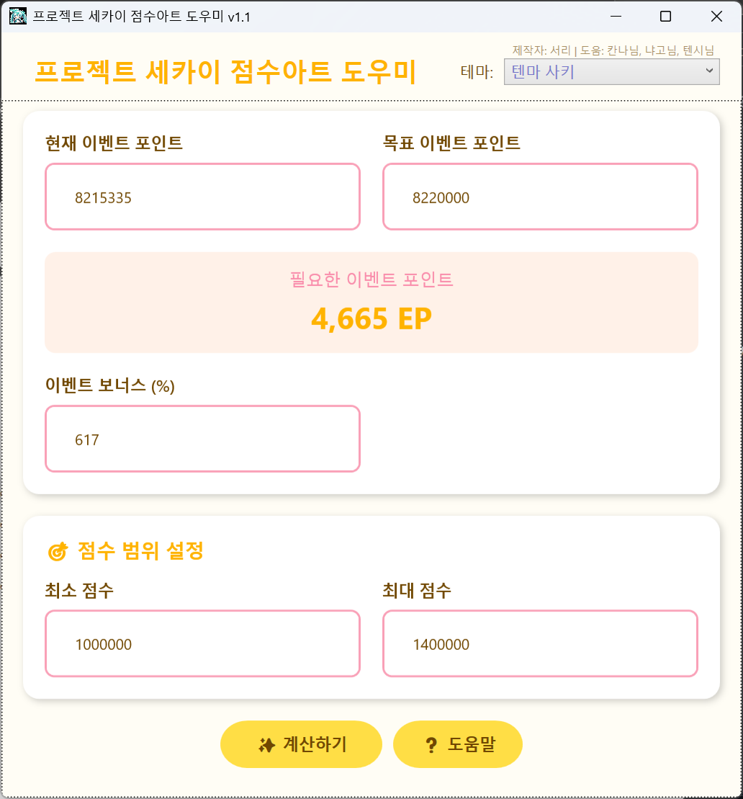

# 🎯 점수아트 도우미 v1.1 (ProSekai Event Calculator)

**프로젝트 세카이** 이벤트에서 **목표 이벤트 포인트에 정확히 도달**할 수 있는 **최적의 플레이 조합을 계산**해주는 Windows용 비공식 도우미 프로그램입니다.

---

## 🖥️ 프로그램 소개

이 프로그램은 이벤트 점수 구조와 불 배율 시스템을 분석하여, 가장 효율적인 플레이 조합을 자동으로 계산합니다.

🔧 주요 기능:

- 목표 EP에 정확히 도달하는 조합 계산
- 불 배율(0~5불)에 따른 효율적 플레이 분배
- 점수 범위 및 보너스 설정 가능
- **계절 테마 및 캐릭터 테마 (총 30종)** 지원
- 자동 설정 저장 (마지막 테마 및 입력 값 복원)
- 단축키 (Enter: 계산 실행, F1: 도움말)

---

## 📷 스크린샷

> 사용 예시 이미지:  

---

## 📥 다운로드

[👉 최신 버전 다운로드 (v1.1)](https://github.com/serveman/ProjectSekaiScoreArtHelper/releases/latest/download/ProSekaiEventCalculator.exe)

- 지원 OS: **Windows 11 (64bit)**
- 압축 해제 후 `ProSekaiEventCalculator.exe` 실행

---

## ⚙️ 사용법

1. 현재 이벤트 포인트 입력  
2. 목표 이벤트 포인트 입력  
3. 이벤트 보너스 입력 (예: 75% → `75`)  
4. 플레이 가능한 점수 범위 설정  
5. 계산하기 버튼 클릭 또는 Enter 키

### 결과창 정보
- 점수 구간별 (20,000점 단위) 조합
- 0불 / 1~5불 사용 플레이 조합
- 총 획득 EP 및 소요 판 수

---

## 🆕 v1.1 업데이트 내용

- 동일 점수 구간에서 **여러 불 배율 조합이 사라지는 문제** 해결
- 이제는 모든 불 배율 결과가 **개별적으로 표시**됨
- 내부 계산 성능 개선 및 버그 수정

---

## 🤖 제작 정보

- 제작자: **서리**
- 테스트 및 피드백: 칸나님, 냐고님, 텐시님
- 카페 게시글: [네이버 카페 바로가기](https://cafe.naver.com/pjsekai/675683)

---

## 📌 주의사항

- 이 도구는 **비공식 도우미**입니다.
- 프로젝트 세카이 공식과는 관련이 없습니다.
- 계산 결과는 점수 조건과 설정에 따라 달라질 수 있습니다.

---

## 🌱 향후 계획

- 일본/글로벌 서버 언어 모드

---

## ⭐ 기여 & 제안

오타, 개선 제안, 기능 요청 등은 언제든 [Issues](https://github.com/serveman/ProjectSekaiScoreArtHelper/issues) 또는 PR로 남겨주세요!

---

