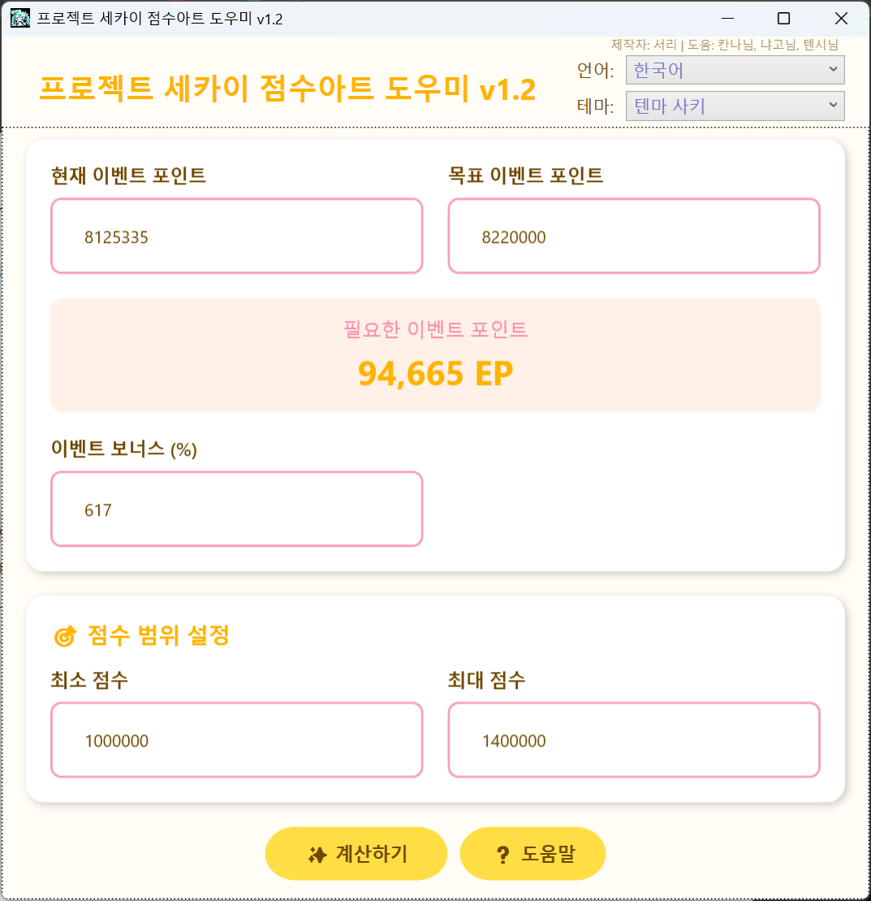
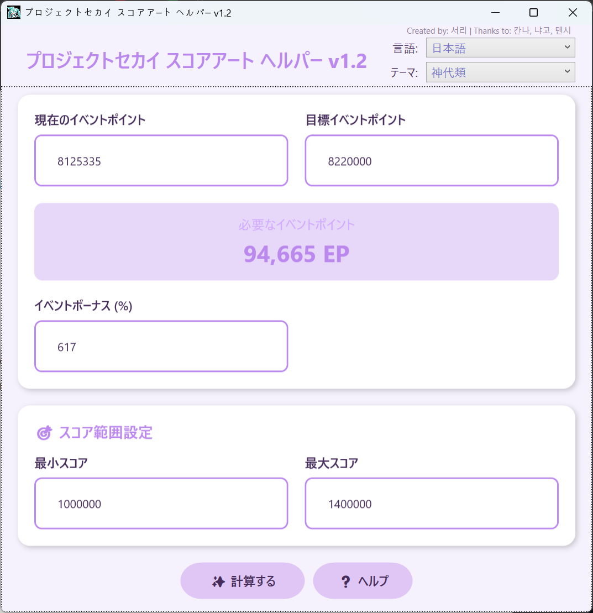
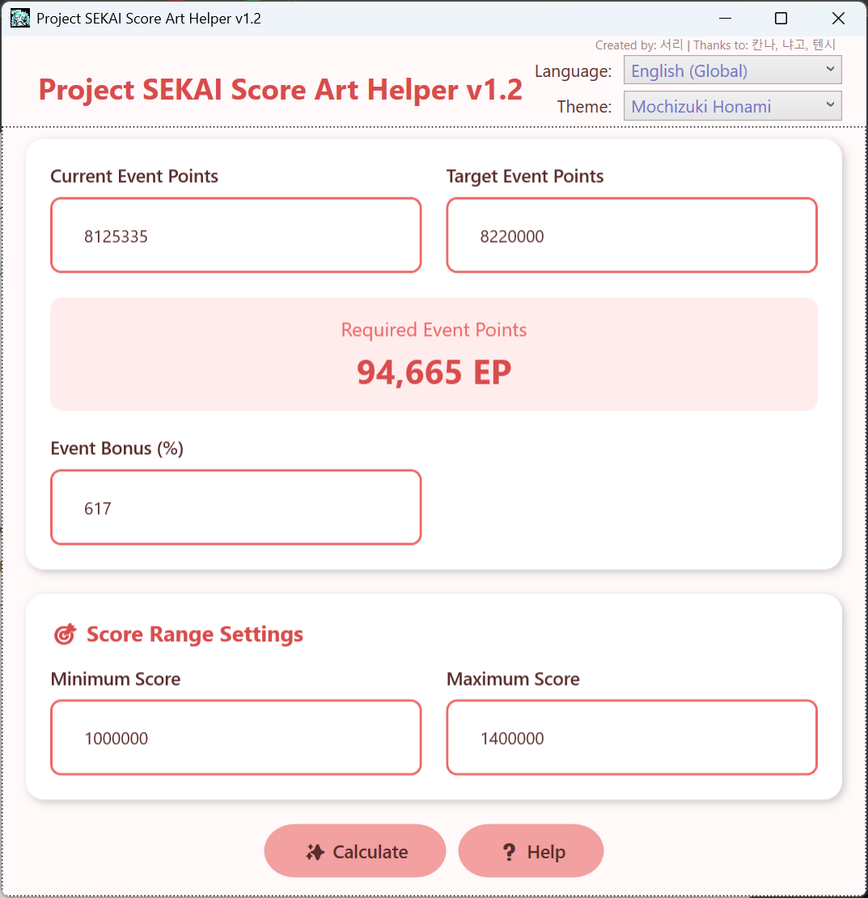

# 🎶 프로젝트 세카이 점수아트 도우미

> **최종 버전:** v1.2.1  
> **제작자:** 서리  
> **테스트 협력:** 칸나, 냐고, 텐시, 지성씨  
> **지원 언어:** 한국어 / 日本語 / English  
> **운영체제:** Windows 10, 11 64bit 기준

---

## 🧭 프로그램 소개

**프로젝트 세카이 점수아트 도우미**는  
목표 이벤트 포인트에 **정확히 도달할 수 있는 최적의 플레이 조합**을 자동으로 계산해주는 도구입니다.  
이벤트 막판 추격, 효율적인 불 소모 전략, 덱 점수 기반의 전략 수립을 도와줍니다.

---

## 🚀 프로그램 실행

- `ProSekaiEventCalculator.exe` 실행
- 설정 파일이 없을 경우 **현재 계절에 맞는 테마**가 자동 적용됨

---

## 📷 스크린샷
> 다국어 지원 예시:

### 한국어 (Korean)

### 日本語 (Japanese) 

### English (Global)

## 🧩 기본 사용법

### 1️⃣ 이벤트 포인트 입력
- **현재 이벤트 포인트**: 현재 보유한 EP 입력
- **목표 이벤트 포인트**: 도달하고자 하는 EP 입력  
→ 자동으로 필요한 EP 차이 계산됨

### 2️⃣ 이벤트 보너스 입력
- **보너스 (%)**: 현재 이벤트의 EP 보너스 퍼센트를 입력  
  (예: 75%라면 `75` 입력, 없으면 `0`)

### 3️⃣ 점수 범위 설정 (예: Envy 점수 기준)
- **최소 점수** / **최대 점수**: 플레이 가능한 범위를 입력  
  본인의 덱에 따라 유연하게 조정

### 4️⃣ 계산 시작
- `계산하기` 버튼 클릭 또는 `Enter` 키 입력  
→ 계산 완료 후 자동으로 결과 창 팝업

---

### 계산 결과 화면

| 항목         | 설명 |
|--------------|------|
| **Score Range** | 점수 구간 (20,000 단위) |
| **Base EP**     | 0불 기준 EP |
| **Flame**       | 사용된 불 배율 (0~5) |
| **Play Count**  | 필요한 플레이 횟수 |
| **EP / Play**   | 1판당 획득 EP |
| **Total EP**    | 해당 조합의 총 획득 EP |

---

## 🎨 테마 변경

- 우측 상단 드롭다운에서 테마 선택 가능
- 계절 테마: 봄 / 여름 / 가을 / 겨울
- 캐릭터 테마: 각 유닛별 총 26종

---

## ⚙️ 기타 기능

- 계산 느릴 경우: 점수 범위를 좁히거나 목표 EP를 소폭 조정
- 설정 자동 저장: 테마, 보너스, 점수 범위 등은 프로그램 종료 시 자동 저장됨
- 단축키:
  - `Enter`: 계산 실행
  - `F1`: 도움말 창 열기

---

## ❓ 자주 묻는 질문

**Q1. "정확히 도달하는 조합을 찾을 수 없습니다" 라는 메시지가 나와요**  
→ 점수 범위를 더 넓히거나 목표 EP를 조금 조정해보세요.

**Q2. 계산이 너무 오래 걸려요**  
→ 점수 범위를 좁히면 속도가 빨라집니다.

---

## 📌 업데이트 내역

### 🔹 v1.0 (최초 버전)
- 목표 EP에 정확히 도달하는 최적의 조합 자동 계산 기능 구현
- 계절 기반 테마 적용 기능 포함

---

### 🔹 v1.1
- **[Bugfix]** 동일 점수 구간에서 여러 불 배율이 있을 때 결과 누락되던 문제 수정
  → 이제 모든 불 배율이 분리되어 정확히 출력됩니다

---

### 🔹 v1.2
- **[New]** 글로벌 다국어 지원: 한국어 / 일본어 / 영어 지원
- 언어 자동 저장 및 자연스러운 번역 텍스트 현지화 적용

---

### 🔹 v1.2.1
- **[Fix]** 0불 플레이의 EP 계산 방식 개선 → **반올림 처리로 수정**
- 결과 화면에 `Base EP` 컬럼 추가 → 0불 기준 EP 명시적으로 표시
- 컬럼명 통일 (`PlayCount` → `Play Count`) 등 UI 가독성 향상

---

## 📝 참고 사항

- 본 프로그램은 **비공식 도구**이며, Project SEKAI 운영팀과는 무관합니다
- 가능한 정확한 결과를 제공하지만, 극히 예외적인 조건에서는 오차가 발생할 수 있습니다
- Windows 10, 11 기준으로 제작 및 테스트됨

---

## 📥 다운로드
[👉 최신 버전 다운로드 (v1.2.1)](https://github.com/serveman/ProjectSekaiScoreArtHelper/releases/latest/download/ProSekaiEventCalculator_v1.2.1.zip)

**시스템 요구사항:**
- 지원 OS: **Windows 10, 11 (64bit)**
- 압축 해제 후 `ProSekaiEventCalculator.exe` 실행
